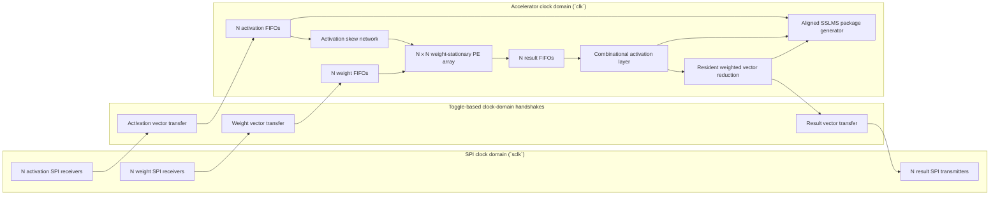
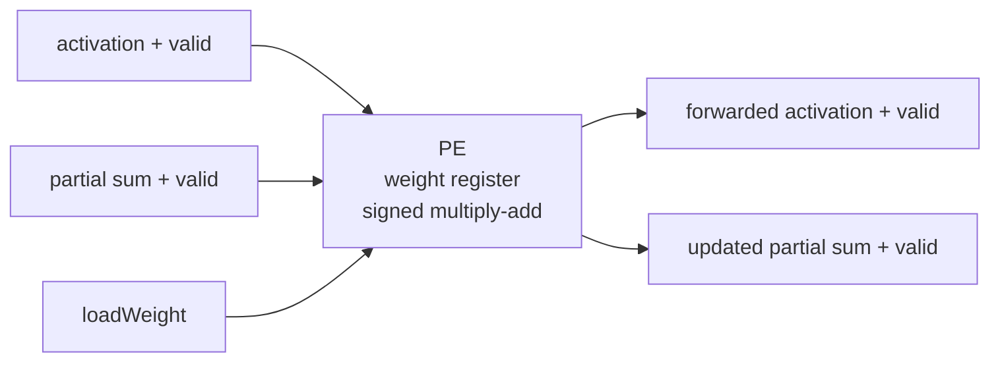
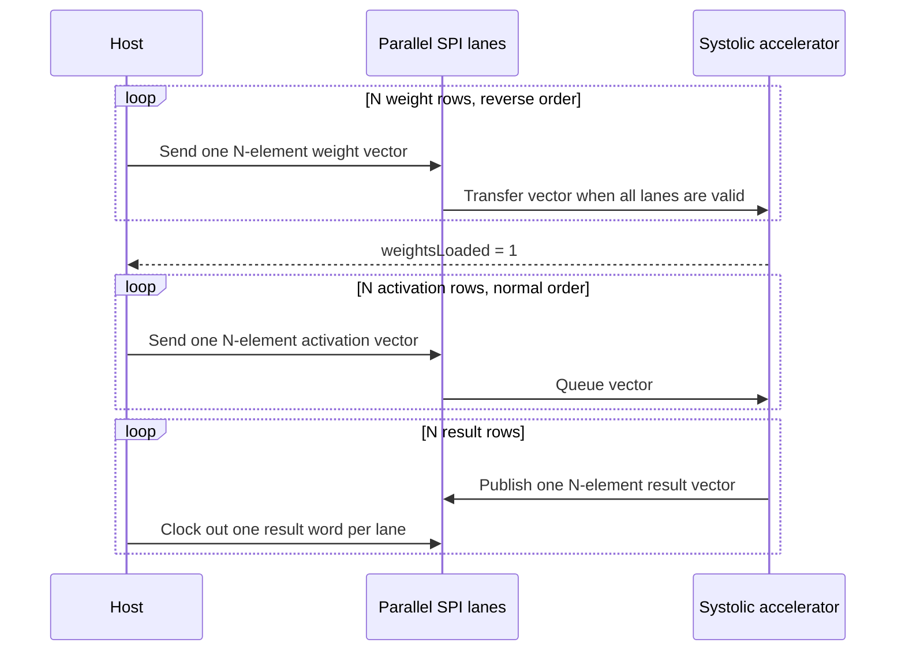

# Parameterized Weight-Stationary Neural-Network Accelerator

This repository contains a signed, parameterized SystemVerilog matrix multiplier built around an `N x N` weight-stationary systolic array. Weights remain inside the processing elements while activation rows stream through the array. FIFO-backed ready/valid interfaces absorb stalls, and the top-level wrapper moves vectors across parallel SPI lanes.

## Architecture



Each processing element stores one weight and performs a signed multiply-accumulate while forwarding the activation and partial sum:



The controller loads weights from the bottom matrix row to the top matrix row. During compute, activation rows enter in normal order and are delayed by lane so that matching products meet on the same diagonal wavefront.



## Data and flow-control contract

- Activation inputs and matrix weights are signed `WIDTH`-bit fixed-point values with `FRACTION_BITS` fractional bits. A stored integer represents `stored_integer / 2^FRACTION_BITS`.
- One vector uses `N` parallel, MSB-first SPI lanes sharing `sclk`. Each lane has its own chip-select and data signal.
- Send weight rows in reverse order: row `N-1` through row `0`.
- Wait for `weightsLoaded` before sending activations.
- Send activation rows in normal order: row `0` through row `N-1`.
- Each result transfer corresponds to one activated output vector. In vector mode lane `j` carries element `j`; in reduction mode lane 0 carries that vector's scalar prediction and the remaining lanes carry zero.
- Accelerator/SPI result-lane width is the architectural prediction width, `2*WIDTH + 2*$clog2(N)` bits. Unreduced activated elements are sign-extended to this width.
- `matrixMultiplierWeightStationary` produces the raw signed `X * W` matrix product at `MATRIX_RESULT_WIDTH = 2*WIDTH + $clog2(N)` without reducing precision. Its binary point has `2*FRACTION_BITS` fractional bits.
- `nnAccelerator` applies activation first (`passThrough = 1` preserves the raw value; `passThrough = 0` applies ReLU), then feeds that one activated output vector to `weightedVectorReduction`.
- Reduction weights are signed fractional coefficients with `REDUCTION_WEIGHT_WIDTH - 1` fractional bits and magnitude at most one. The reduction retains each complete product and accumulates at `MATRIX_RESULT_WIDTH + REDUCTION_WEIGHT_WIDTH + $clog2(N)` bits.
- After the full weighted sum is complete, one arithmetic right shift by `FRACTION_BITS + REDUCTION_WEIGHT_WIDTH - 1` returns the prediction to the input/target binary-point position. Only then is it narrowed to the architectural prediction width.
- `reduceOutput = 0` returns the sign-extended activated vector. `reduceOutput = 1` returns the rescaled prediction in lane 0 and zero in lanes `1:N-1`.
- `reductionWeight[N]` is the initialization vector for resident reduction-weight registers. Pulsing `loadReductionWeights` copies the complete vector atomically. Loading has priority over learning and can change a combinational prediction, so configuration software must use it only while the sample pipeline is quiescent.
- Every `resultValid && resultReady` training completion applies one saturating stored-LSB update to each resident reduction weight. Positive, zero, and negative activated elements select `+learningDirection`, zero, and `-learningDirection`, respectively.
- The same completion asserts `matrixUpdateValid` with signed two-bit ternary `rowDirection[N]` and `columnDirection[N]` vectors. Rows carry the accepted original-input signs. Columns use the pre-update resident reduction-weight signs and the pass-through/ReLU activation gate. Phase 5B only creates this package; it does not modify matrix PE weights.
- Phase 5C can apply each nonzero matrix direction as one stored-code step; with `FRACTION_BITS = 4`, that PE-weight step is `mu = 1/16`.
- Original input signs and targets are pushed and popped by the same sample events. Either FIFO can therefore backpressure the complete activation/target/sign transaction, and their heads remain paired with the current prediction under result stalls.
- Assert `reloadWeights` only while `reloadReady` is high.
- `weightReady` and `activationReady` indicate when a complete parallel SPI vector may be started.

## Parameters

| Parameter | Default | Meaning |
| --- | ---: | --- |
| `WIDTH` | `16` | Signed input and weight width |
| `N` | `3` | Square matrix and systolic-array dimension; currently tested for 2-4 |
| `FRACTION_BITS` | `4` | Fractional bits in activation inputs, matrix weights, predictions, and targets |
| `TARGET_WIDTH` | `WIDTH` | Signed target width; narrower targets are sign-extended for prediction comparison |
| `REDUCTION_WEIGHT_WIDTH` | `WIDTH` | Signed weighted-readout coefficient width; all bits except the sign bit are fractional |
| `INPUT_FIFO_DEPTH` | `2*N` | Per-lane activation FIFO depth |
| `OUTPUT_FIFO_DEPTH` | `2*N` | Per-lane result FIFO depth |

## Verification

The self-checking regression covers:

- 2x2, 3x3, and 4x4 arrays
- signed and edge-case operands
- worst-case positive and negative accumulation
- fixed-point weighted vector reduction with signed operands, cancellation, full-width accumulation, and a single final arithmetic rescale
- raw signed matrix-product results
- composed pass-through and ReLU accelerator results
- composed activation-to-reduction behavior, one rescaled scalar per activated vector at the architectural prediction width
- atomic activation/target acceptance, including target-FIFO-full backpressure
- ordered target comparison for back-to-back and bubbled samples, with vectors chosen to expose off-by-one pairing
- signed target comparison for all three learning directions, including negative narrow-target sign extension and stable output stalls
- resident reduction-weight loading and signed one-LSB updates at both saturation endpoints
- aligned ternary matrix-update packages, including zero input signs and a closed ReLU gate
- input bubbles, output backpressure, and back-to-back matrices
- weight reloads
- asynchronous `clk`/`sclk` SPI input and output transfers

With ModelSim commands (`vlib`, `vlog`, and `vsim`) on `PATH`, run:

```powershell
pwsh -File scripts/run_modelsim.ps1
```

With ModelSim configured, the regression script treats any simulation error as
a failure.

At the `nnAccelerator` boundary, `targetData` is accepted atomically with the
complete `activationData[N]` vector on `activationValid && activationReady`.
One ordered target FIFO contributes to activation backpressure and presents its
head as `resultTargetData`; that head advances only with the shared
`resultValid && resultReady` result transaction. No fixed pipeline latency is
used to align targets and predictions. While `resultValid` is asserted, the
signed 2-bit `learningDirection` compares that target head with the full scalar
prediction: `+1` when the target is greater, `0` when equal, and `-1` when the
target is less. Narrower operands are sign-extended for the comparison, and the
target, prediction, and direction remain stable together under backpressure.
An equally deep packed FIFO carries two-bit signs for every original input lane.
On the result handshake, those signs and the current pre-activation values form
one `rowDirection`/`columnDirection` package while the resident reduction
weights receive their independent saturating update. Because nonblocking state
updates occur after the edge, the package always observes the same pre-update
reduction weights that produced its prediction.

### UVM core verification environment

A core-level UVM environment is available in [`uvm/`](uvm/). It connects
directly to `matrixMultiplierWeightStationary`, with an active ready/valid
driver, passive accepted-input reconstruction, passive result monitor,
independent signed reference model/scoreboard, protocol assertions, and
license-safe coverage counters. The scoreboard derives matrices from traffic
accepted by the DUT rather than copying the driver's expected values.

The regression uses seeded `$urandom` stimulus instead of constrained
randomization and covergroups, so it remains usable with the Questa FPGA
Starter license. The seed is printed in the log and can be replayed:

```powershell
pwsh -File scripts/run_uvm.ps1
pwsh -File scripts/run_uvm.ps1 -TestName nn_uvm_smoke_test
pwsh -File scripts/run_uvm.ps1 -TestName nn_uvm_regression_test -Seed 12345
```

The UVM compile targets the direct core interface at `N=3`, `WIDTH=8` for a
fast regression. The existing directed regression remains the reference for
the supported 2x2, 3x3, and 4x4 configurations.

### FPGA build snapshot

A Quartus Prime 25.1 Standard Lite compilation completed successfully for the
default `N=3`, `WIDTH=16` configuration, targeting the DE1-SoC Cyclone V
`5CSEMA5F31C6` device.

| Metric | Post-fit result |
|---|---:|
| Logic utilization | 666 / 32,070 ALMs (2%) |
| Registers | 1,230 |
| Block memory | 1,044 / 4,065,280 bits (<1%) |
| RAM blocks | 7 / 397 (2%) |
| DSP blocks | 9 / 87 (10%) |
| I/O pins | 30 / 457 (7%) |

The project constrains `clk` to 50 MHz in `NN_Acceleration.sdc`. The post-fit
Timing Analyzer passes that requirement at every analyzed corner, with
worst-case setup slack of 10.954 ns, worst-case hold slack of 0.154 ns, and a
worst reported slow-corner same-clock-domain Fmax estimate of 110.55 MHz.

The design is not yet fully timing-constrained or ready for board programming:
the externally supplied SPI `sclk`, input/output delays, relationships between
clock domains, and DE1-SoC pin locations still need explicit constraints.

## Repository layout

```text
.
|-- SPI_Module.sv
|-- memory/
|   `-- signedFifo.sv
|-- weightStationaryVariant/
|   |-- matrixMultiplierWeightStationary.sv
|   |-- nnAccelerator.sv
|   |-- matrixMultiplierWeightStationarySPI.sv
|   |-- systolicArrayWeightStationary.sv
|   |-- multiplierBlockWeightStationary.sv
|   |-- activationLayer.sv
|   |-- reluActivation.sv
|   |-- weightedVectorReduction.sv
|   |-- weightedVectorReduction_tb.sv
|   |-- matrixMultiplierWeightStationary_tb.sv
|   `-- matrixMultiplierWeightStationarySPI_tb.sv
|-- Quartus Stuff/
|   |-- NN_Acceleration.qpf
|   `-- NN_Acceleration.qsf
|-- scripts/
|   |-- run_modelsim.ps1
|   `-- run_uvm.ps1
`-- uvm/
|   |-- nn_core_if.sv
|   |-- nn_core_items.sv
|   |-- nn_core_driver.sv
|   |-- nn_core_monitors.sv
|   |-- nn_core_checking.sv
|   |-- nn_core_sequences_tests.sv
|   |-- nn_uvm_pkg.sv
|   `-- nn_uvm_tb_top.sv
```
