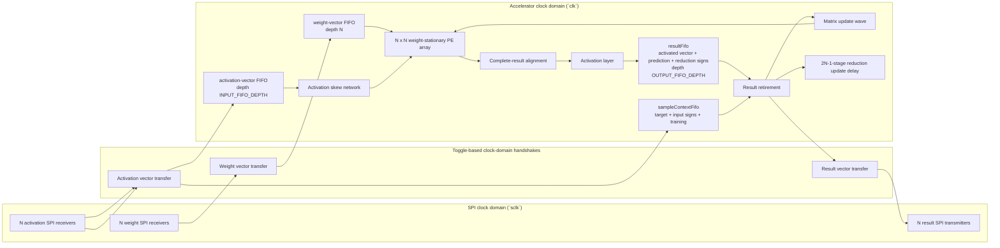
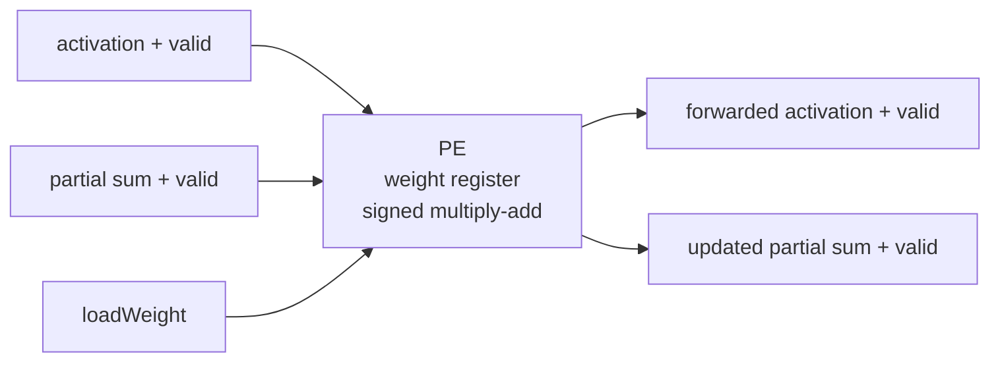
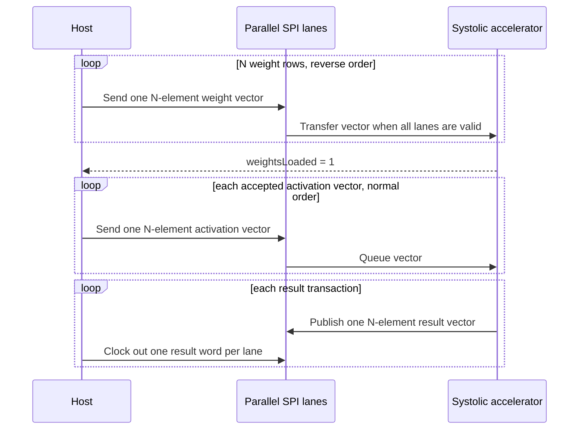

# Parameterized Weight-Stationary Neural-Network Accelerator

This repository contains a signed, parameterized SystemVerilog matrix multiplier built around an `N x N` weight-stationary systolic array. Weights remain inside the processing elements while activation rows stream through the array. FIFO-backed ready/valid interfaces absorb stalls, and the top-level wrapper moves vectors across parallel SPI lanes.

## Architecture



The core has three architectural FIFOs: the activation-vector FIFO,
`sampleContextFifo`, and the accelerator-owned `resultFifo`. Each result FIFO
entry is one transaction containing the activated vector, its prediction, and
the resident reduction-weight signs used to produce that prediction.

Each processing element stores one weight and performs a signed multiply-accumulate while forwarding the activation and partial sum:



The controller loads weights from the bottom matrix row to the top matrix row. During compute, activation rows enter in normal order and are delayed by lane so that matching products meet on the same diagonal wavefront.



## Data and flow-control contract

### Transaction state and stream configuration

`activationData`, `targetData`, and `trainingEnable` are per-sample
transaction state. They are accepted atomically on
`activationValid && activationReady`; the existing datapath and transaction
state keeps them aligned with the corresponding result.

`passThrough` and `reduceOutput` are accelerator stream configuration, not
per-sample metadata. They may be selected before traffic begins. Once a sample
is accepted, both signals must remain stable until the accelerator has
completely drained every accepted sample, buffered result, and learning update
associated with that stream. After the accelerator is quiescent, either signal
may be changed before new traffic is accepted. In short, the supported
sequence is configure, process a stream, drain, then reconfigure; changing
either mode while work is outstanding is illegal. The mode bits do not travel
through `sampleContextFifo` or `resultFifo`, and the RTL intentionally
continues to use their live, configuration-lifetime values.

- Activation inputs and matrix weights are signed `WIDTH`-bit fixed-point values with `FRACTION_BITS` fractional bits. A stored integer represents `stored_integer / 2^FRACTION_BITS`.
- One vector uses `N` parallel, MSB-first SPI lanes sharing `sclk`. Each lane has its own chip-select and data signal.
- Send weight rows in reverse order: row `N-1` through row `0`.
- Wait for `weightsLoaded` before sending activations.
- Send activation vectors in normal order. If they are being used as an
  `N`-row matrix, vector `0` through vector `N-1` correspond to matrix rows
  `0` through `N-1`.
- Each result transfer corresponds to one activated output vector. In vector mode lane `j` carries element `j`; in reduction mode lane 0 carries that vector's scalar prediction and the remaining lanes carry zero.
- Accelerator/SPI result-lane width is the architectural prediction width, `2*WIDTH + 2*$clog2(N)` bits. Unreduced activated elements are sign-extended to this width.
- `matrixMultiplierWeightStationary` produces the raw signed `X * W` matrix product at `MATRIX_RESULT_WIDTH = 2*WIDTH + $clog2(N)` without reducing precision. Its binary point has `2*FRACTION_BITS` fractional bits.
- At the aligned matrix-result handshake, `nnAccelerator` applies activation exactly once (`passThrough = 1` preserves the raw value; `passThrough = 0` applies ReLU), feeds that activated vector to `weightedVectorReduction`, and stores the activated vector, prediction, and resident reduction signs as one `resultFifo` entry.
- Reduction weights default to signed 8-bit Q1.7 fractional coefficients (one sign bit and seven fractional bits), so one stored LSB is `1/128`. The reduction retains each complete product and accumulates at `MATRIX_RESULT_WIDTH + REDUCTION_WEIGHT_WIDTH + $clog2(N)` bits.
- After the full weighted sum is complete, one arithmetic right shift by `FRACTION_BITS + REDUCTION_WEIGHT_WIDTH - 1` returns the prediction to the input/target binary-point position. Only then is it narrowed to the architectural prediction width.
- `reduceOutput = 0` returns the sign-extended activated vector. `reduceOutput = 1` returns the rescaled prediction in lane 0 and zero in lanes `1:N-1`.
- Results form an ordered stream of independent sample transactions. Each `resultValid && resultReady` handshake retires exactly one result and its matching sample context; there is no group-boundary marker or modulo-`N` result position.
- `reductionWeight[N]` is the initialization vector for resident reduction-weight registers. Pulsing `loadReductionWeights` copies the complete vector atomically. Loading has priority over learning, so configuration software must use it only while the sample and update pipelines are quiescent.
- Result retirement pops one `resultFifo` entry and one sample-context entry together. If the retired sample's buffered `trainingEnable` is high, retirement launches one packed matrix-update package and one reduction-update package. Positive, zero, and negative activated elements select `+learningDirection`, zero, and `-learningDirection`, respectively. An inference sample still produces and consumes its prediction normally but does not launch an update.
- The same training-enabled completion asserts `matrixUpdateValid` with signed two-bit ternary `rowDirection[N]` and `columnDirection[N]` vectors. Rows carry the accepted original-input signs. Columns use the reduction-weight signs stored with that result and the pass-through/ReLU activation gate.
- Each valid package updates PE(0,0) directly on its acceptance edge, then `2*N-2` registered stages carry it across the remaining PE anti-diagonals. Diagonal `d` updates every PE where `row + column == d` by the ternary outer product, with signed one-LSB saturation. The update pipeline and datapath share `arrayAdvance`, so both freeze together under backpressure and successive packages may overlap.
- The local `systolicArrayWeightStationary.updateComplete` event still asserts once for each package on the advancing edge that applies its final anti-diagonal. `reductionUpdateValidPipe` and `reductionUpdateDirectionPipe` receive the same retired-result package in `nnAccelerator` and advance under the matrix engine's `datapathAdvance`. The final valid stage applies the reduction update after the unchanged `2*N-1` delay.
- A PE multiply and the weighted reduction both use their resident weights present before an update edge. Accepting the last old-state result applies the reduction direction directly to the sole resident reduction vector with signed one-LSB saturation; the next sample then uses both the updated matrix and updated reduction weights. With `FRACTION_BITS = 4`, one matrix-weight step is `mu = 1/16`.
- In continuous no-stall traffic, a sample's scalar prediction is available after `2*N-1` cycles, its learning direction is formed combinationally in that cycle, and PE(0,0) applies the update on the following edge. The sample on that edge still uses the old weight; the next sample is the first affected, so update `U_S` first affects sample `S + 2*N + 1` (distance 7 for `N=3`).
- The matrix and reduction update mechanisms are separate from result storage: a full `resultFifo` freezes the aligned matrix datapath and both update paths together until a result retires. No update-only readout events, full reduction-vector snapshots, version counters, or catch-up cycles exist in the current architecture; only each result's activated vector, prediction, and required ternary signs are stored.
- `sampleContextFifo` stores target, original-input signs, and per-sample `trainingEnable`; its head advances only when the corresponding result entry retires. The current SPI adapter supports normal inference. If `trainingEnable` is asserted through that adapter, `targetData` is supplied as zero, so learning is toward target zero; arbitrary supervised targets are not transported by the present SPI interface.
- Assert `reloadWeights` only while `reloadReady` is high.
- Stream quiescence and matrix reload readiness are distinct. Stream
  quiescence means that no accepted sample, result, or update work remains, so
  `passThrough`/`reduceOutput` may change at that boundary. `reloadReady` is
  high when the matrix engine reports its loaded state is reloadable and the
  result FIFO, sample-context FIFO, and reduction-update pipeline are empty or
  idle. The number of previously retired samples has no effect, so a fully
  drained stream can reload after one sample or any other sample count.
- `N` still determines the vector width, systolic-array dimension, and square
  matrix geometry. Sending `N` consecutive activation vectors still produces
  the corresponding `N` rows of `XW` when desired, but those results are not
  intrinsically grouped by the accelerator.
- The skew storage may remain physically rectangular, but its live geometry is
  triangular: lane `i` propagates through stages `0..i` and consumes stage `i`.
  Stages beyond that consuming stage are never shifted or considered by
  `skewBusy`.
- `weightReady` and `activationReady` indicate when a complete parallel SPI vector may be started.

## Parameters

| Parameter | Default | Meaning |
| --- | ---: | --- |
| `WIDTH` | `16` | Signed input and weight width |
| `N` | `3` | Square matrix and systolic-array dimension; currently tested for 2-4 |
| `FRACTION_BITS` | `4` | Fractional bits in activation inputs, matrix weights, predictions, and targets |
| `TARGET_WIDTH` | `WIDTH` | Signed target width; narrower targets are sign-extended for prediction comparison |
| `REDUCTION_WEIGHT_WIDTH` | `8` | Signed weighted-readout coefficient width; the default Q1.7 format has one sign bit and seven fractional bits |
| `INPUT_FIFO_DEPTH` | `2*N` | Activation-vector FIFO depth |
| `OUTPUT_FIFO_DEPTH` | `2*N` | Depth of the accelerator-owned `resultFifo` |

## Verification

Verification is split by responsibility so that each guarantee has one
primary owner:

- `FunctionalReference` owns end-to-end numerical and learning behavior.
- `CycleReference` plus the RTL trace bridge owns accelerator latency,
  W/R evolution, FIFO contents, bubbles, backpressure state, and the
  drain-before-reconfiguration contract for `passThrough`/`reduceOutput`.
- The core UVM environment owns randomized matrix-engine interface traffic,
  reset/reload, ordering, and compact traffic coverage. Its small matrix
  predictor checks result data during that randomized traffic; accelerator
  result ordering is checked by the integrated reference/RTL trace.
- Directed RTL units own reduction arithmetic, PE/update-wave mechanics, and
  `N=2/3/4` matrix-core parameterization.
- The SPI bench owns serialization, CDC, ordering, and output backpressure,
  with one identity-matrix numerical smoke transaction.

Run the complete regression in ownership order with:

```powershell
pwsh -File scripts/run_modelsim.ps1
```

This runs the Python reference tests, local RTL units, golden RTL comparison,
UVM protocol regression, and SPI regression in that order.

The Phase 6E golden RTL comparison can also be run directly:

```powershell
pwsh -File scripts/run_rtl_reference_compare.ps1
```

### Core behavior: existing UVM environment

The core-level UVM environment in [`uvm/`](uvm/) connects directly to
`matrixMultiplierWeightStationary`. It provides an active ready/valid driver,
passive accepted-input reconstruction, a passive result monitor, an
independent signed reference model/scoreboard, protocol assertions, and
license-safe coverage counters. Its core checks cover signed and edge-case
operands, raw matrix-product results, input/output backpressure, back-to-back
matrices, weight reloads, and reset during weight load or activation.

Run the core UVM regression with:

```powershell
pwsh -File scripts/run_uvm.ps1 -TestName nn_uvm_regression_test
```

The scripts discover the Quartus-installed Questa under
`C:\altera_lite\25.1std\questa_fse\win64`; a different installation can be
selected with `NN_ACCEL_QUESTA_BIN`. With Questa configured, the regression
scripts treat any simulation error as a failure.

At the `nnAccelerator` boundary, `targetData` and `trainingEnable` are accepted
atomically with the complete `activationData[N]` vector on
`activationValid && activationReady`. The packed `sampleContextFifo` contributes
to activation backpressure and presents its
head as `resultTargetData`; that head advances only with the shared
`resultValid && resultReady` result transaction. No fixed pipeline latency is
used to align targets and predictions. While `resultValid` is asserted, the
signed 2-bit `learningDirection` compares that target head with the full scalar
prediction: `+1` when the target is greater, `0` when equal, and `-1` when the
target is less. Narrower operands are sign-extended for the comparison, and the
target, prediction, and direction remain stable together under backpressure.
The `sampleContextFifo` carries two-bit signs for every original input lane and
the training-enable bit. The accelerator-owned `resultFifo` stores the
activated vector, prediction, and resident reduction-weight signs as one
transaction. The raw matrix result is not retained after that entry is formed.
On a training-enabled result handshake, those signs and the current
pre-activation values form one `rowDirection`/`columnDirection` package while
the corresponding reduction directions are packed into an update sideband.
The package observes the same resident reduction weights that produced its
prediction.
On an `arrayAdvance`, the matrix engine applies the live package directly to
anti-diagonal zero and captures it for anti-diagonals 1 through `2*N-2`. Weight loading
has priority over learning, and matrix-update stages contribute to pipeline-busy
state so a reload cannot overtake a pending update wave. The reduction sideband
follows the same `arrayAdvance` slots. At retirement, the stored activated
vector, prediction, and reduction signs are used directly; a training result
retirement launches its packed ternary directions, with the matrix update
starting at PE(0,0) on that edge and the delayed reduction update applying
after `2*N-1` advancing slots.
Backpressure holds the result/context heads together, preserving ordering
without full per-sample reduction-vector snapshots, combinational next-state
selection, version comparison, or continuous-stream catch-up cycles.

The regression uses seeded `$urandom` stimulus instead of constrained
randomization and covergroups, so it remains usable with the Questa FPGA
Starter license. The seed is printed in the log and can be replayed:

```powershell
pwsh -File scripts/run_uvm.ps1
pwsh -File scripts/run_uvm.ps1 -TestName nn_uvm_smoke_test
pwsh -File scripts/run_uvm.ps1 -TestName nn_uvm_regression_test -Seed 12345
```

The UVM compile targets the direct core interface at `N=3`, `WIDTH=8` for a
fast regression. `matrixMultiplierWeightStationary_tb.sv` retains focused
coverage of the supported 2x2, 3x3, and 4x4 configurations.

### FPGA/build documentation

The checked-in Quartus project in `Quartus Stuff/NN_Acceleration.qsf` currently
targets Cyclone V device `5CGXFC7C7F23C8` and uses
`matrixMultiplierWeightStationarySPI` as its top-level entity.

The following numbers are a historical build snapshot, not a synthesis result
for the current checked-in QSF. They are retained as reported for the default
`N=3`, `WIDTH=16` configuration on the DE1-SoC Cyclone V
`5CSEMA5F31C6` device:

| Metric | Historical post-fit result |
|---|---:|
| Logic utilization | 666 / 32,070 ALMs (2%) |
| Registers | 1,230 |
| Block memory | 1,044 / 4,065,280 bits (<1%) |
| RAM blocks | 7 / 397 (2%) |
| DSP blocks | 9 / 87 (10%) |
| I/O pins | 30 / 457 (7%) |

No `.sdc` file is checked in, and the current QSF does not assign one. Therefore
this repository makes no current timing-constraint or Timing Analyzer claim.
Any timing values associated with the historical table were produced by that
historical build and must not be interpreted as results for the current QSF.

The current project also has no checked-in pin assignment or external SPI
`sclk`/input-output delay constraints, so it is not documented here as ready
for board programming.

## Repository layout

```text
.
|-- SPI_Module.sv
|-- memory/
|   `-- signedFifo.sv
|-- weightStationaryVariant/
|   |-- matrixMultiplierWeightStationary.sv
|   |-- nnAccelerator.sv
|   |-- matrixMultiplierWeightStationarySPI.sv
|   |-- systolicArrayWeightStationary.sv
|   |-- multiplierBlockWeightStationary.sv
|   |-- activationLayer.sv
|   |-- reluActivation.sv
|   |-- weightedVectorReduction.sv
|   |-- weightedVectorReduction_tb.sv
|   |-- matrixMultiplierWeightStationary_tb.sv
|   |-- matrixWeightUpdateWave_tb.sv
|   |-- nnAcceleratorStateTrace_tb.sv
|   `-- matrixMultiplierWeightStationarySPI_tb.sv
|-- reference/
|   |-- arithmetic.py
|   |-- functional.py
|   |-- cycle.py
|   |-- rtl_reference_compare.py
|   |-- test_functional.py
|   `-- test_cycle.py
|-- Quartus Stuff/
|   |-- NN_Acceleration.qpf
|   `-- NN_Acceleration.qsf
|-- scripts/
|   |-- run_modelsim.ps1
|   |-- run_rtl_reference_compare.ps1
|   `-- run_uvm.ps1
`-- uvm/
|   |-- nn_core_if.sv
|   |-- nn_core_items.sv
|   |-- nn_core_driver.sv
|   |-- nn_core_monitors.sv
|   |-- nn_core_checking.sv
|   |-- nn_core_sequences_tests.sv
|   |-- nn_uvm_pkg.sv
|   `-- nn_uvm_tb_top.sv
```
