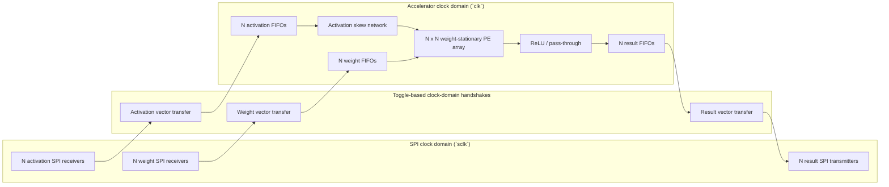
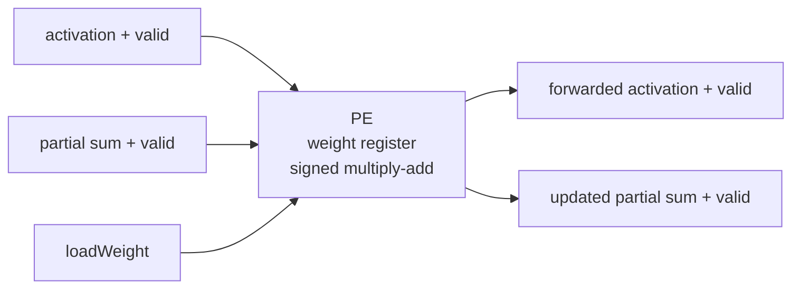
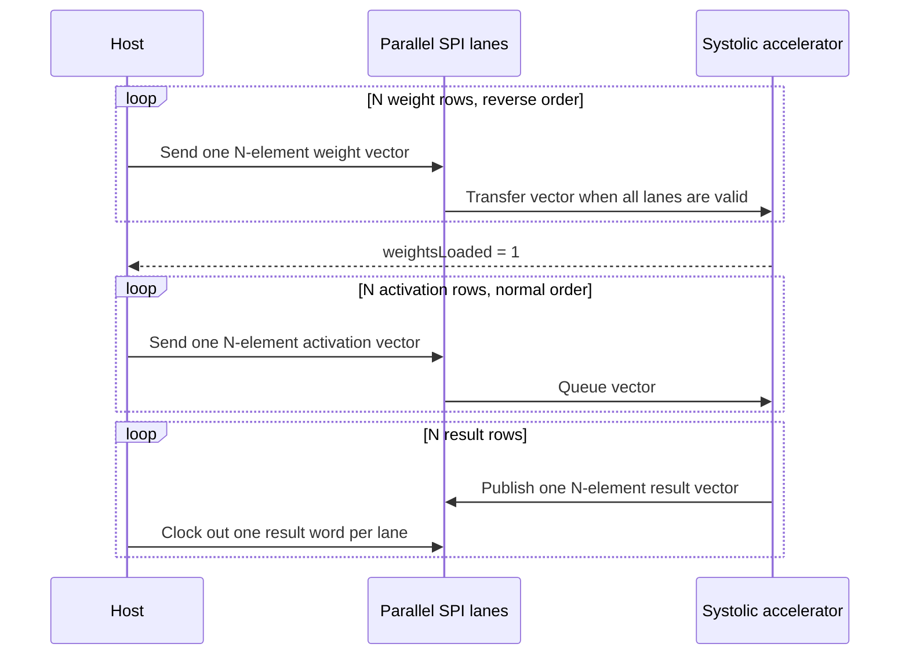

# Parameterized Weight-Stationary Neural-Network Accelerator

This repository contains a signed, parameterized SystemVerilog matrix multiplier built around an `N x N` weight-stationary systolic array. Weights remain inside the processing elements while activation rows stream through the array. FIFO-backed ready/valid interfaces absorb stalls, and the top-level wrapper moves vectors across parallel SPI lanes.

## Architecture



Each processing element stores one weight and performs a signed multiply-accumulate while forwarding the activation and partial sum:



The controller loads weights from the bottom matrix row to the top matrix row. During compute, activation rows enter in normal order and are delayed by lane so that matching products meet on the same diagonal wavefront.



## Data and flow-control contract

- All matrix elements are signed `WIDTH`-bit two's-complement values.
- One vector uses `N` parallel, MSB-first SPI lanes sharing `sclk`. Each lane has its own chip-select and data signal.
- Send weight rows in reverse order: row `N-1` through row `0`.
- Wait for `weightsLoaded` before sending activations.
- Send activation rows in normal order: row `0` through row `N-1`.
- Each result transfer is one output row. Lane `j` carries output column `j`.
- Result width is `2*WIDTH + $clog2(N)` bits.
- `passThrough = 1` preserves signed results; `passThrough = 0` applies ReLU.
- Assert `reloadWeights` only while `reloadReady` is high.
- `weightReady` and `activationReady` indicate when a complete parallel SPI vector may be started.

## Parameters

| Parameter | Default | Meaning |
| --- | ---: | --- |
| `WIDTH` | `16` | Signed input and weight width |
| `N` | `3` | Square matrix and systolic-array dimension; currently tested for 2-4 |
| `INPUT_FIFO_DEPTH` | `2*N` | Per-lane activation FIFO depth |
| `OUTPUT_FIFO_DEPTH` | `2*N` | Per-lane result FIFO depth |

## Verification

The self-checking regression covers:

- 2x2, 3x3, and 4x4 arrays
- signed and edge-case operands
- worst-case positive and negative accumulation
- ReLU and pass-through output modes
- input bubbles, output backpressure, and back-to-back matrices
- weight reloads
- asynchronous `clk`/`sclk` SPI input and output transfers

With ModelSim commands (`vlib`, `vlog`, and `vsim`) on `PATH`, run:

```powershell
pwsh -File scripts/run_modelsim.ps1
```

The current regressions complete with zero simulation errors.

### UVM learning environment

A partial UVM environment is available in [`uvm/`](uvm/). It implements
two end-to-end `N=2`, `WIDTH=8` cases using a sequence, sequencer, SPI host
driver, passive result monitor, reference-model scoreboard, and analysis
subscriber. The original directed tests remain unchanged. The starter avoids
constrained-random and covergroup constructs so it can run with the Questa FPGA
Starter license; adding them is one of the guided exercises.

The runner uses Questa's precompiled `mtiUvm` library (UVM 1.1d in the current
Quartus 25.1 installation) so the directed starter works with that license.

Run the two-case starter regression with the Questa installation bundled with
Quartus 25.1:

```powershell
pwsh -File scripts/run_uvm.ps1
```

See [`uvm/EXERCISES.md`](uvm/EXERCISES.md) for an incremental path to add
constrained-random clock ratios, partial frames, reset injection, lane skew,
passive input prediction, coverage crosses, and protocol assertions.

### FPGA build snapshot

A Quartus Prime 25.1 Standard Lite compilation completed successfully for the
default `N=3`, `WIDTH=16` configuration, targeting the DE1-SoC Cyclone V
`5CSEMA5F31C6` device.

| Metric | Post-fit result |
|---|---:|
| Logic utilization | 666 / 32,070 ALMs (2%) |
| Registers | 1,230 |
| Block memory | 1,044 / 4,065,280 bits (<1%) |
| RAM blocks | 7 / 397 (2%) |
| DSP blocks | 9 / 87 (10%) |
| I/O pins | 30 / 457 (7%) |

The project constrains `clk` to 50 MHz in `NN_Acceleration.sdc`. The post-fit
Timing Analyzer passes that requirement at every analyzed corner, with
worst-case setup slack of 10.954 ns, worst-case hold slack of 0.154 ns, and a
worst reported slow-corner same-clock-domain Fmax estimate of 110.55 MHz.

The design is not yet fully timing-constrained or ready for board programming:
the externally supplied SPI `sclk`, input/output delays, relationships between
clock domains, and DE1-SoC pin locations still need explicit constraints.

## Repository layout

```text
.
|-- SPI_Module.sv
|-- memory/
|   `-- signedFifo.sv
|-- weightStationaryVariant/
|   |-- matrixMultiplierWeightStationary.sv
|   |-- matrixMultiplierWeightStationarySPI.sv
|   |-- systolicArrayWeightStationary.sv
|   |-- multiplierBlockWeightStationary.sv
|   |-- activationLayer.sv
|   |-- reluActivation.sv
|   |-- matrixMultiplierWeightStationary_tb.sv
|   `-- matrixMultiplierWeightStationarySPI_tb.sv
|-- Quartus Stuff/
|   |-- NN_Acceleration.qpf
|   `-- NN_Acceleration.qsf
|-- scripts/
|   `-- run_modelsim.ps1
|-- systolic_array_3x3_dataflow.tex
`-- systolic_array_3x3_dataflow.pdf
```

The accompanying data-flow note derives the 3x3 mapping and shows how the diagonal activation wavefront produces `C = A x B`.
