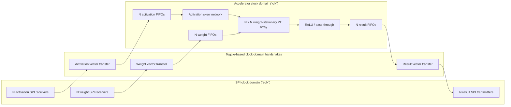
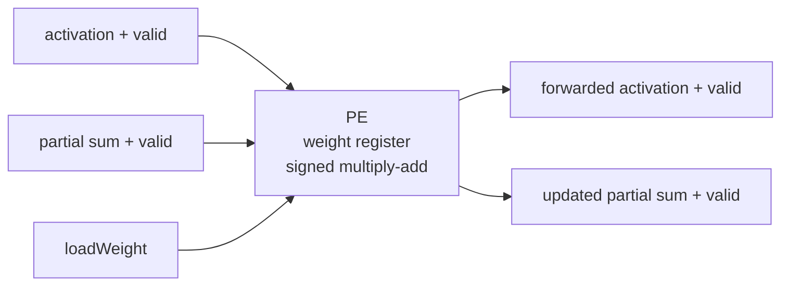
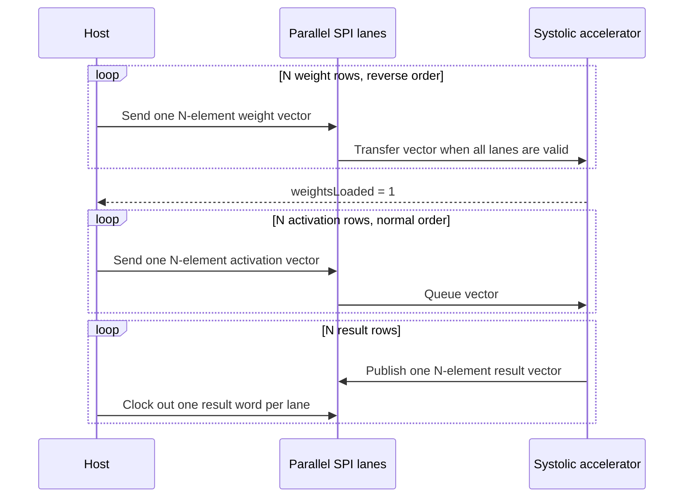
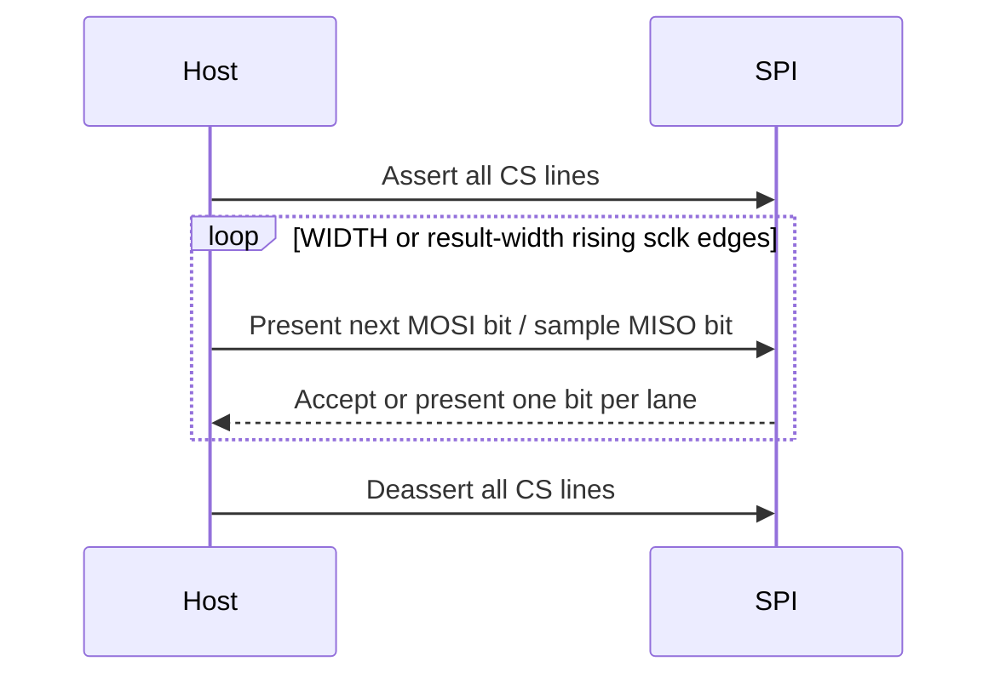

# Parameterized Weight-Stationary Neural-Network Accelerator

This repository contains a signed, parameterized SystemVerilog matrix multiplier built around an `N x N` weight-stationary systolic array. Weights remain inside the processing elements while activation rows stream through the array. FIFO-backed ready/valid interfaces absorb stalls, and the top-level wrapper moves vectors across parallel SPI lanes.

## Architecture



Each processing element stores one weight and performs a signed multiply-accumulate while forwarding the activation and partial sum:



The controller loads weights from the bottom matrix row to the top matrix row. During compute, activation rows enter in normal order and are delayed by lane so that matching products meet on the same diagonal wavefront.



## Data and flow-control contract

- All matrix elements are signed `WIDTH`-bit two's-complement values.
- One vector uses `N` parallel, MSB-first SPI lanes sharing `sclk`. Each lane has its own chip-select and data signal.
- Send weight rows in reverse order: row `N-1` through row `0`.
- Wait for `weightsLoaded` before sending activations.
- Send activation rows in normal order: row `0` through row `N-1`.
- Each result transfer is one output row. Lane `j` carries output column `j`.
- Result width is `2*WIDTH + $clog2(N)` bits.
- `passThrough = 1` preserves signed results; `passThrough = 0` applies ReLU.
- Assert `reloadWeights` only while `reloadReady` is high.
- `weightReady` and `activationReady` indicate when a complete parallel SPI vector may be started.

## SPI transaction contract

- `cs_n`, `weightCs_n`, and `activationCs_n` are active-low and are controlled per lane.
- Set MOSI before each rising `sclk` edge. Input words are sampled MSB first; lane `j` carries vector element `j`.
- Assert all input CS lines for exactly `WIDTH` rising edges. Releasing CS early discards the partial word and the next frame starts at its MSB.
- A complete input word is held until the accelerator accepts it. Extra clocks while it is held do not change the word; deassert CS before starting another frame.
- Assert all result CS lines together and wait for every `misoValid` lane before sampling. Result bits are presented MSB first and are sampled on rising `sclk` edges.
- Releasing result CS pauses the word and reasserting it resumes at the same bit. After the final bit, `misoValid` is low and `miso` is zero until the next result is available.
- `rst_n` is synchronous to both `clk` and `sclk`. Hold it low through a rising edge of each clock, keep CS high, and restart the transaction after reset; the accelerator and any partial SPI frame are cleared.
- There is no timeout, error, or sequence signal. Retry an incomplete input after releasing CS; resume an interrupted result by reasserting CS, or reset and restart the sequence.

Each vector is one parallel transaction. The wrapper forwards an input only after every lane has a complete word, and latches a result for all lanes together. Hosts should therefore drive and sample all lanes in lockstep.



Minimal host sequence:

```text
send(vector, cs): wait(ready); assert cs; send each lane MSB first; deassert cs
receive(): assert all result CS; wait(all misoValid); sample each lane MSB first; deassert CS
```

## Parameters

| Parameter | Default | Meaning |
| --- | ---: | --- |
| `WIDTH` | `16` | Signed input and weight width; must be >= 1 |
| `N` | `3` | Square matrix and systolic-array dimension; must be >= 2, tested for 2-4 |
| `INPUT_FIFO_DEPTH` | `2*N` | Per-lane activation FIFO depth; must be >= 2 |
| `OUTPUT_FIFO_DEPTH` | `2*N` | Per-lane result FIFO depth; must be >= 2 |

`N=2` and FIFO depth `2` are the lower regression boundaries. Larger parameter
values are limited by device resources.

## Verification

The self-checking regression covers:

- 2x2, 3x3, and 4x4 arrays
- signed and edge-case operands
- worst-case positive and negative accumulation
- ReLU and pass-through output modes
- input bubbles, output backpressure, and back-to-back matrices
- weight reloads
- asynchronous `clk`/`sclk` SPI input and output transfers
- SPI partial-frame, reset, extra-clock, and chip-select pause recovery

With ModelSim commands (`vlib`, `vlog`, and `vsim`) on `PATH`, run:

```powershell
pwsh -File scripts/run_modelsim.ps1
```

The current regressions complete with zero simulation errors. FPGA resource utilization, Fmax, and timing closure are not reported yet.

## Repository layout

```text
.
|-- SPI_Module.sv
|-- memory/
|   `-- signedFifo.sv
|-- weightStationaryVariant/
|   |-- matrixMultiplierWeightStationary.sv
|   |-- matrixMultiplierWeightStationarySPI.sv
|   |-- systolicArrayWeightStationary.sv
|   |-- multiplierBlockWeightStationary.sv
|   |-- activationLayer.sv
|   |-- reluActivation.sv
|   |-- matrixMultiplierWeightStationary_tb.sv
|   `-- matrixMultiplierWeightStationarySPI_tb.sv
|-- Quartus Stuff/
|   |-- NN_Acceleration.qpf
|   `-- NN_Acceleration.qsf
|-- scripts/
|   `-- run_modelsim.ps1
|-- systolic_array_3x3_dataflow.tex
`-- systolic_array_3x3_dataflow.pdf
```

The accompanying data-flow note derives the 3x3 mapping and shows how the diagonal activation wavefront produces `C = A x B`.
