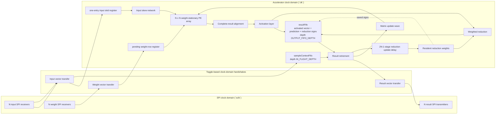
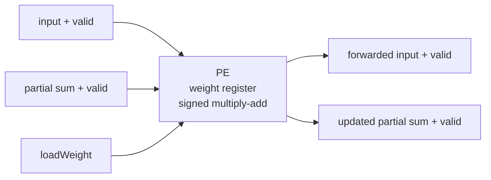
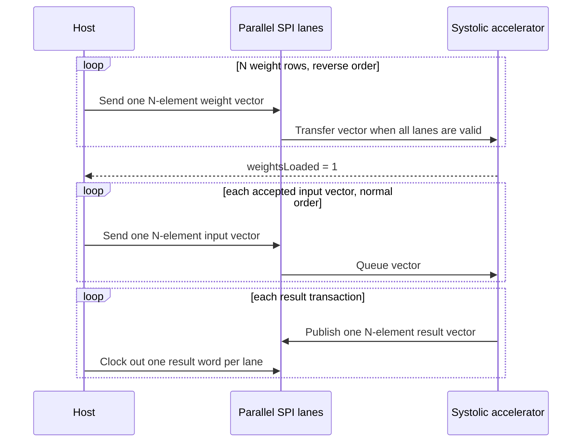

# Parameterized Weight-Stationary Neural-Network Accelerator

This repository contains a signed, parameterized SystemVerilog neural-network accelerator built around an `N x N` weight-stationary systolic array. The array holds matrix weights while input vectors stream through it. The accelerator adds activation, a weighted reduction, and training updates. Its ready/valid core uses a one-entry input register and two transaction FIFOs; an SPI wrapper moves vectors across parallel lanes.

## Architecture



The matrix engine buffers one accepted input vector in a data register with a
valid bit. It can consume that vector and accept its replacement on the same
edge. The accelerator has two FIFOs: `sampleContextFifo` holds each sample's
target, original-input signs, and training bit from acceptance to retirement;
`resultFifo` holds the activated vector, prediction, and reduction-weight signs
from result completion to retirement. `IN_FLIGHT_DEPTH` limits accepted samples
that have not retired.

Each processing element stores one weight and performs a signed multiply-accumulate while forwarding the input and partial sum:



The controller loads weights from the bottom matrix row to the top matrix row. During compute, input rows enter in normal order and are delayed by lane so that matching products meet on the same diagonal wavefront.



## Data and flow-control contract

### Transaction state and stream configuration

`inputData`, `targetData`, and `trainingEnable` are per-sample
transaction state. They are accepted atomically on
`inputValid && inputReady`; the existing datapath and transaction
state keeps them aligned with the corresponding result.

`passThrough` and `reduceOutput` are accelerator stream configuration, not
per-sample metadata. They may be selected before traffic begins. Once a sample
is accepted, both signals must remain stable until the accelerator has
completely drained every accepted sample, buffered result, and learning update
associated with that stream. After the accelerator is quiescent, either signal
may be changed before new traffic is accepted. In short, the supported
sequence is configure, process a stream, drain, then reconfigure; changing
either mode while work is outstanding is illegal. The mode bits do not travel
through `sampleContextFifo` or `resultFifo`, and the RTL intentionally
continues to use their live, configuration-lifetime values.

- Input values and matrix weights are signed `WIDTH`-bit fixed-point values with `FRACTION_BITS` fractional bits. A stored integer represents `stored_integer / 2^FRACTION_BITS`.
- One vector uses `N` parallel, MSB-first SPI lanes sharing `sclk`. Each lane has its own chip-select and data signal.
- Send weight rows in reverse order: row `N-1` through row `0`.
- Wait for `weightsLoaded` before sending inputs.
- Send input vectors in normal order. If they are being used as an
  `N`-row matrix, vector `0` through vector `N-1` correspond to matrix rows
  `0` through `N-1`.
- Each result transfer corresponds to one activated output vector. In vector mode lane `j` carries element `j`; in reduction mode lane 0 carries that vector's scalar prediction and the remaining lanes carry zero.
- Accelerator/SPI result-lane width is the architectural prediction width, `2*WIDTH + 2*$clog2(N)` bits. Unreduced activated elements are sign-extended to this width.
- `weightStationaryMatrixMultiplier` produces the raw signed `X * W` matrix product at `MATRIX_RESULT_WIDTH = 2*WIDTH + $clog2(N)` without reducing precision. Its binary point has `2*FRACTION_BITS` fractional bits.
- At the aligned matrix-result handshake, `nnAccelerator` applies activation exactly once (`passThrough = 1` preserves the raw value; `passThrough = 0` applies ReLU), feeds that activated vector to `weightedVectorReduction`, and stores the activated vector, prediction, and resident reduction signs as one `resultFifo` entry.
- Reduction weights default to signed 8-bit Q1.7 fractional coefficients (one sign bit and seven fractional bits), so one stored LSB is `1/128`. The reduction retains each complete product and accumulates at `MATRIX_RESULT_WIDTH + REDUCTION_WEIGHT_WIDTH + $clog2(N)` bits.
- After the full weighted sum is complete, one arithmetic right shift by `FRACTION_BITS + REDUCTION_WEIGHT_WIDTH - 1` returns the prediction to the input/target binary-point position. Only then is it narrowed to the architectural prediction width.
- `reduceOutput = 0` returns the sign-extended activated vector. `reduceOutput = 1` returns the rescaled prediction in lane 0 and zero in lanes `1:N-1`.
- Results form an ordered stream of independent sample transactions. Each `resultValid && resultReady` handshake retires exactly one result and its matching sample context; there is no group-boundary marker or modulo-`N` result position.
- `reductionWeight[N]` is the initialization vector for resident reduction-weight registers. Pulsing `loadReductionWeights` copies the complete vector atomically. Loading has priority over learning, so configuration software must use it only while the sample and update pipelines are quiescent.
- Result retirement pops one `resultFifo` entry and one sample-context entry together. If the retired sample's buffered `trainingEnable` is high, retirement launches one packed matrix-update package and one reduction-update package. Positive, zero, and negative activated elements select `+learningDirection`, zero, and `-learningDirection`, respectively. An inference sample still produces and consumes its prediction normally but does not launch an update.
- The same training-enabled completion forms one internal package: a `matrixUpdateValid` strobe with signed two-bit ternary `rowDirection[N]` and `columnDirection[N]` vectors. Rows carry the accepted original-input signs. Columns use the reduction-weight signs stored with that result and the pass-through/ReLU activation gate. The package is wiring between `nnAccelerator` and its matrix engine, not an accelerator output.
- Each valid package updates PE(0,0) directly on its acceptance edge, then `2*N-2` registered stages carry it across the remaining PE anti-diagonals. Diagonal `d` updates every PE where `row + column == d` by the ternary outer product, with signed one-LSB saturation. The update pipeline and datapath share `arrayAdvance`, so both freeze together under backpressure and successive packages may overlap.
- A package's final anti-diagonal is applied on the advancing edge that retires the last stage of `weightStationarySystolicArray.updateValidPipe`; the array exposes no separate completion event. `reductionUpdateValidPipe` and `reductionUpdateDirectionPipe` receive the same retired-result package in `nnAccelerator` and advance under the matrix engine's `arrayAdvance`. The final valid stage applies the reduction update after the unchanged `2*N-1` delay.
- A PE multiply and the weighted reduction both use their resident weights present before an update edge. Accepting the last old-state result applies the reduction direction directly to the sole resident reduction vector with signed one-LSB saturation; the next sample then uses both the updated matrix and updated reduction weights. With `FRACTION_BITS = 4`, one matrix-weight step is `mu = 1/16`.
- In continuous no-stall traffic, a sample's scalar prediction is available after `2*N-1` cycles, its learning direction is formed combinationally in that cycle, and PE(0,0) applies the update on the following edge. The sample on that edge still uses the old weight; the next sample is the first affected, so update `U_S` first affects sample `S + 2*N + 1` (distance 7 for `N=3`).
- The matrix and reduction update mechanisms are separate from result storage: a full `resultFifo` freezes the aligned matrix datapath and both update paths together until a result retires. No update-only readout events, full reduction-vector snapshots, version counters, or catch-up cycles exist in the current architecture; only each result's activated vector, prediction, and required ternary signs are stored.
- `sampleContextFifo` stores target, original-input signs, and per-sample `trainingEnable`; its head advances only when the corresponding result entry retires. `IN_FLIGHT_DEPTH` bounds accepted-but-unretired samples, while the matrix engine's input register holds one vector. The SPI wrapper does not transport targets: it supplies `targetData = 0` to the core. Asserting `trainingEnable` through that wrapper therefore learns toward zero; arbitrary supervised targets require the direct core interface.
- Assert `reloadWeights` only while `reloadReady` is high.
- Stream quiescence and matrix reload readiness are distinct. Stream
  quiescence means that no accepted sample, result, or update work remains, so
  `passThrough`/`reduceOutput` may change at that boundary. `reloadReady` is
  high when the matrix engine reports its loaded state is reloadable and the
  result FIFO, sample-context FIFO, and reduction-update pipeline are empty or
  idle. The number of previously retired samples has no effect, so a fully
  drained stream can reload after one sample or any other sample count.
- `N` still determines the vector width, systolic-array dimension, and square
  matrix geometry. Sending `N` consecutive input vectors still produces
  the corresponding `N` rows of `XW` when desired, but those results are not
  intrinsically grouped by the accelerator.
- The skew storage may remain physically rectangular, but its live geometry is
  triangular: lane `i` propagates through stages `0..i` and consumes stage `i`.
  Stages beyond that consuming stage are never shifted or considered by
  `skewBusy`.
- `weightReady` and `inputReady` indicate when a complete parallel SPI vector may be started.

### SPI transaction contract

- `cs_n`, `weightCs_n`, and `inputCs_n` are active-low and controlled per
  lane. Drive all lanes in lockstep for a vector transaction.
- Set MOSI before each rising `sclk` edge. Weight and input words are sampled
  MSB first; lane `j` carries vector element `j`.
- Assert every input CS line for exactly `WIDTH` rising edges. Releasing CS
  early discards the partial word, and the next frame restarts at its MSB.
- A complete input word remains stable until the accelerator accepts it.
  Extra clocks while it is held do not change the word; deassert CS before
  starting another frame.
- Assert all result CS lines together and wait until every `misoValid` lane is
  high before sampling. Result words are MSB first and
  `2*WIDTH + 2*$clog2(N)` bits wide.
- Releasing result CS pauses the current word. Reasserting it resumes at the
  same bit. After the final bit, `misoValid` is low and `miso` is zero until a
  new result is available.
- `rst_n` is synchronous in both the `clk` and `sclk` domains. Hold it low
  through a rising edge of each clock, keep every CS high, and restart any
  interrupted transaction after reset.
- There is no timeout or error signal. Retry an incomplete input after
  releasing CS; resume an interrupted result or reset and restart it.

## Parameters

| Parameter | Default | Meaning |
| --- | ---: | --- |
| `WIDTH` | `16` | Signed input and weight width; must be >= 1 |
| `N` | `3` | Square matrix and systolic-array dimension; must be >= 2, tested for 2-4 |
| `FRACTION_BITS` | `4` | Fractional bits in input values, matrix weights, predictions, and targets; must be >= 0 |
| `TARGET_WIDTH` | `WIDTH` | Signed target width; must be >= 1, and narrower targets are sign-extended for prediction comparison |
| `REDUCTION_WEIGHT_WIDTH` | `8` | Signed weighted-readout coefficient width; must be >= 1, and the default Q1.7 format has one sign bit and seven fractional bits |
| `IN_FLIGHT_DEPTH` | `2*N+2` | Maximum accepted-but-unretired samples; depth of `sampleContextFifo`, must be >= 1 |
| `OUTPUT_FIFO_DEPTH` | `2*N` | Depth of the accelerator-owned `resultFifo`; must be >= 1 |

The matrix engine's one-entry input register is fixed in size; it is not a
parameterized FIFO. The generic `signedFifo` is used for the sample-context and
result FIFOs and supports `DEPTH >= 1`.

## Verification

Verification is split by responsibility so that each guarantee has one
primary owner:

- `arithmetic.py` owns the numerical semantics. Both references delegate to
  it, so `test_arithmetic.py` pins each primitive directly.
- `FunctionalReference` owns end-to-end numerical and learning behavior, and
  states update visibility in closed form as `2*N + 1` sample positions.
- `CycleReference` plus the RTL trace bridge owns accelerator latency,
  W/R evolution, FIFO contents, bubbles, backpressure state, and the
  drain-before-reconfiguration contract for `passThrough`/`reduceOutput`. It
  reaches the same visibility delay by wave propagation; that agreement, not
  their shared arithmetic, is the load-bearing cross-check.
- The core UVM environment owns randomized public `nnAccelerator` traffic,
  simple reset/reload recovery, ordering, and no-loss/no-duplication checks. It
  uses three project transactions: an active/observed sample item, a compact
  configuration item, and a retired-result transaction. It runs in pass-through
  vector mode and checks inference numerically while the matrix is known, but
  treats training and inference using learned state as liveness and ordering
  checks. Activation and reduction modes, exact learning, and cycle/state
  behavior remain owned by the references and RTL trace.
- Directed RTL units own reduction arithmetic, PE/update-wave mechanics, and
  `N=2/3/4` matrix-core parameterization. The matrix-engine bench is limited to
  deterministic arithmetic, signed accumulation edges, basic loading, and one
  direct result-boundary backpressure check; the update-wave bench keeps only
  physical anti-diagonal propagation, stall, and drain checks.
- The SPI bench owns serialization, CDC, ordering, and output backpressure,
  with one identity-matrix numerical smoke transaction.

Run the complete regression in ownership order with:

```powershell
pwsh -File scripts/run_modelsim.ps1
```

This runs the Python reference tests, local RTL units, RTL/reference comparison,
UVM protocol regression, and SPI regression in that order.

Run the cycle-by-cycle RTL/reference comparison separately with:

```powershell
pwsh -File scripts/run_rtl_reference_compare.ps1
```

### Core behavior: sample-oriented UVM environment

The UVM environment in [`uvm/`](uvm/) connects directly to the public
`nnAccelerator` interface. One accepted input vector is one sample item,
and one `resultValid && resultReady` handshake is one result item. Weight and
reduction loading are explicit configuration commands, not fields on every
sample. The input monitor tracks the loaded matrix locally and snapshots it
into the accepted sample; only accepted samples and retired results cross
analysis ports. The scoreboard checks ordered counts and reset invalidation. It
checks exact pass-through vector results only while the matrix weights are
known. Training results must retire, but inference using learned weights is
outside its numeric scope until the matrix is reloaded. Activation and
reduction modes, learning waves, and internal FIFO state are checked by the
Python references and RTL trace.

The regression uses explicit scenario assertions for input bubbles, output
backpressure, input backpressure, reloads, and resets instead of a
standalone generic coverage component.

Run the core UVM regression with:

```powershell
pwsh -File scripts/run_uvm.ps1 -TestName nn_uvm_regression_test
```

The scripts discover the Quartus-installed Questa under
`C:\altera_lite\25.1std\questa_fse\win64`; a different installation can be
selected with `NN_ACCEL_QUESTA_BIN`. With Questa configured, the regression
scripts treat any simulation error as a failure.

At the `nnAccelerator` boundary, `targetData` and `trainingEnable` are accepted
atomically with the complete `inputData[N]` vector on
`inputValid && inputReady`. The packed `sampleContextFifo` contributes
to input backpressure and presents its head internally as
`resultTargetData`; that head advances only with the shared
`resultValid && resultReady` result transaction. No fixed pipeline latency is
used to align targets and predictions. While `resultValid` is asserted, the
signed 2-bit `learningDirection` compares that target head with the full scalar
prediction: `+1` when the target is greater, `0` when equal, and `-1` when the
target is less. Narrower operands are sign-extended for the comparison, and the
target, prediction, and direction remain stable together under backpressure.
Neither signal is an accelerator port: both are internal to the retirement
path, and `nnAcceleratorStateTrace_tb` observes them hierarchically alongside
the other internal evidence it traces.
The `sampleContextFifo` carries two-bit signs for every original input lane and
the training-enable bit. The accelerator-owned `resultFifo` stores the
activated vector, prediction, and resident reduction-weight signs as one
transaction. The raw matrix result is not retained after that entry is formed.
On a training-enabled result handshake, those signs and the stored activated
vector form one `rowDirection`/`columnDirection` package while
the corresponding reduction directions are packed into an update sideband.
The matrix directions use the reduction-weight signs captured with the
prediction, even if the resident reduction weights have changed since enqueue.
On an `arrayAdvance`, the matrix engine applies the live package directly to
anti-diagonal zero and captures it for anti-diagonals 1 through `2*N-2`. Weight loading
has priority over learning, and matrix-update stages contribute to pipeline-busy
state so a reload cannot overtake a pending update wave. The reduction sideband
follows the same `arrayAdvance` slots. At retirement, the stored activated
vector, prediction, and reduction signs are used directly; a training result
retirement launches its packed ternary directions, with the matrix update
starting at PE(0,0) on that edge and the delayed reduction update applying
after `2*N-1` advancing slots.
Backpressure holds the result/context heads together, preserving ordering
without full per-sample reduction-vector snapshots, combinational next-state
selection, version comparison, or continuous-stream catch-up cycles.

The regression uses seeded `$urandom` stimulus instead of constrained
randomization and covergroups, so it remains usable with the Questa FPGA
Starter license. The seed is printed in the log and can be replayed:

```powershell
pwsh -File scripts/run_uvm.ps1
pwsh -File scripts/run_uvm.ps1 -TestName nn_uvm_smoke_test
pwsh -File scripts/run_uvm.ps1 -TestName nn_uvm_regression_test -Seed 12345
```

The UVM compile targets the direct `nnAccelerator` interface at `N=3`,
`WIDTH=8` for a fast regression. `weightStationaryMatrixMultiplier_tb.sv`
retains focused coverage of the supported 2x2, 3x3, and 4x4 configurations.

### FPGA/build documentation

The checked-in Quartus project in `Quartus Stuff/NN_Acceleration.qsf` targets
the DE1-SoC Cyclone V `5CSEMA5F31C6` and uses
`weightStationaryMatrixMultiplierTop` as its top-level entity. A Quartus Prime
25.1 Standard Lite fit of the default `N=3`, `WIDTH=16` configuration,
recorded before the one-entry FIFO was replaced by a register, produced:

| Metric | Recorded post-fit result |
|---|---:|
| Logic utilization | 976 / 32,070 ALMs (3%) |
| Registers | 1,615 |
| Block memory | 912 / 4,065,280 bits (<1%) |
| RAM blocks | 6 / 397 (2%) |
| DSP blocks | 18 / 87 (21%) |
| I/O pins | 57 / 457 (12%) |

`Quartus Stuff/NN_Acceleration.sdc` constrains the primary `clk` input to
50 MHz. That earlier post-fit Timing Analyzer run reported non-negative slack
at every analyzed corner for that clock; its worst reported setup slack was
+4.197 ns and its worst hold slack was +0.152 ns. The register change has not
been re-fitted, so these utilization and timing figures are historical. The
external SPI `sclk`, I/O delays, and physical pin locations remain
application-specific and are not assigned, so the design is not yet documented
as ready for board programming. The timing result does not establish full
interface timing closure. RTL
regressions compile the source directly, so the Quartus project does not request
a separate post-fit EDA simulation netlist.

## Repository layout

```text
.
|-- SPI_Module.sv
|-- memory/
|   `-- signedFifo.sv
|-- weightStationaryVariant/
|   |-- weightStationaryMatrixMultiplier.sv
|   |-- nnAccelerator.sv
|   |-- weightStationaryMatrixMultiplierTop.sv
|   |-- weightStationarySystolicArray.sv
|   |-- weightStationaryProcessingElement.sv
|   |-- weightedVectorReduction.sv
|   |-- weightedVectorReduction_tb.sv
|   |-- weightStationaryMatrixMultiplier_tb.sv
|   |-- matrixWeightUpdateWave_tb.sv
|   |-- nnAcceleratorStateTrace_tb.sv
|   `-- weightStationaryMatrixMultiplierTop_tb.sv
|-- reference/
|   |-- arithmetic.py
|   |-- functional.py
|   |-- cycle.py
|   |-- rtl_reference_compare.py
|   |-- test_arithmetic.py
|   |-- test_functional.py
|   `-- test_cycle.py
|-- Quartus Stuff/
|   |-- NN_Acceleration.qpf
|   |-- NN_Acceleration.qsf
|   |-- NN_Acceleration.sdc
|   `-- NN_Acceleration_assignment_defaults.qdf
|-- scripts/
|   |-- questa_env.ps1
|   |-- run_modelsim.ps1
|   |-- run_rtl_reference_compare.ps1
|   `-- run_uvm.ps1
`-- uvm/
|   |-- nn_core_if.sv
|   |-- nn_core_items.sv
|   |-- nn_core_driver.sv
|   |-- nn_core_monitors.sv
|   |-- nn_core_checking.sv
|   |-- nn_core_sequences_tests.sv
|   |-- nn_uvm_pkg.sv
|   `-- nn_uvm_tb_top.sv
```
