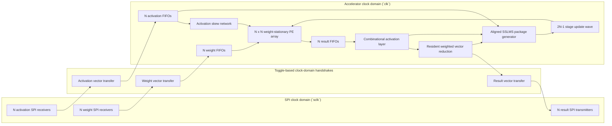
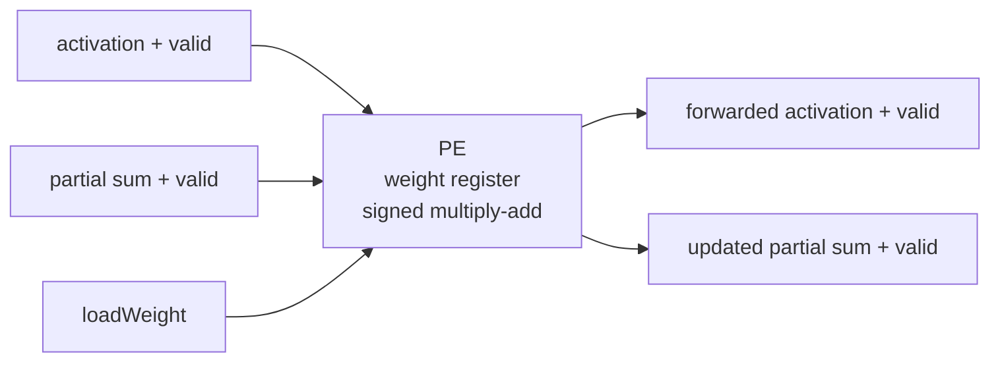
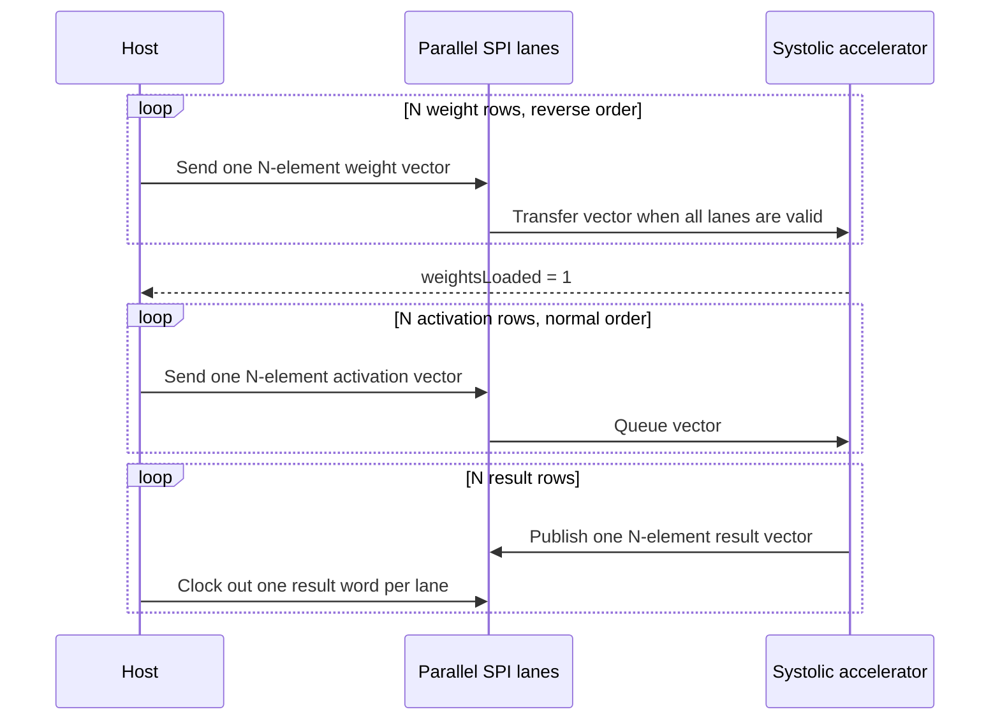

# Parameterized Weight-Stationary Neural-Network Accelerator

This repository contains a signed, parameterized SystemVerilog matrix multiplier built around an `N x N` weight-stationary systolic array. Weights remain inside the processing elements while activation rows stream through the array. FIFO-backed ready/valid interfaces absorb stalls, and the top-level wrapper moves vectors across parallel SPI lanes.

## Architecture



Each processing element stores one weight and performs a signed multiply-accumulate while forwarding the activation and partial sum:



The controller loads weights from the bottom matrix row to the top matrix row. During compute, activation rows enter in normal order and are delayed by lane so that matching products meet on the same diagonal wavefront.



## Data and flow-control contract

- Activation inputs and matrix weights are signed `WIDTH`-bit fixed-point values with `FRACTION_BITS` fractional bits. A stored integer represents `stored_integer / 2^FRACTION_BITS`.
- One vector uses `N` parallel, MSB-first SPI lanes sharing `sclk`. Each lane has its own chip-select and data signal.
- Send weight rows in reverse order: row `N-1` through row `0`.
- Wait for `weightsLoaded` before sending activations.
- Send activation rows in normal order: row `0` through row `N-1`.
- Each result transfer corresponds to one activated output vector. In vector mode lane `j` carries element `j`; in reduction mode lane 0 carries that vector's scalar prediction and the remaining lanes carry zero.
- Accelerator/SPI result-lane width is the architectural prediction width, `2*WIDTH + 2*$clog2(N)` bits. Unreduced activated elements are sign-extended to this width.
- `matrixMultiplierWeightStationary` produces the raw signed `X * W` matrix product at `MATRIX_RESULT_WIDTH = 2*WIDTH + $clog2(N)` without reducing precision. Its binary point has `2*FRACTION_BITS` fractional bits.
- `nnAccelerator` applies activation first (`passThrough = 1` preserves the raw value; `passThrough = 0` applies ReLU), then feeds that one activated output vector to `weightedVectorReduction`.
- Reduction weights default to signed 8-bit Q1.7 fractional coefficients (one sign bit and seven fractional bits), so one stored LSB is `1/128`. The reduction retains each complete product and accumulates at `MATRIX_RESULT_WIDTH + REDUCTION_WEIGHT_WIDTH + $clog2(N)` bits.
- After the full weighted sum is complete, one arithmetic right shift by `FRACTION_BITS + REDUCTION_WEIGHT_WIDTH - 1` returns the prediction to the input/target binary-point position. Only then is it narrowed to the architectural prediction width.
- `reduceOutput = 0` returns the sign-extended activated vector. `reduceOutput = 1` returns the rescaled prediction in lane 0 and zero in lanes `1:N-1`.
- `reductionWeight[N]` is the initialization vector for resident reduction-weight registers. Pulsing `loadReductionWeights` copies the complete vector atomically. Loading has priority over learning, so configuration software must use it only while the sample and update pipelines are quiescent.
- Every `resultValid && resultReady` completion whose buffered `trainingEnable` is high launches one packed reduction-update sideband alongside its matrix-update package. Positive, zero, and negative activated elements select `+learningDirection`, zero, and `-learningDirection`, respectively. An inference sample still produces and consumes its prediction normally but does not launch an update.
- The same training-enabled completion asserts `matrixUpdateValid` with signed two-bit ternary `rowDirection[N]` and `columnDirection[N]` vectors. Rows carry the accepted original-input signs. Columns use that sample's snapshotted reduction-weight signs and the pass-through/ReLU activation gate.
- A `2*N-1` stage pipeline carries each valid package across the PE anti-diagonals. Stage `d` updates every PE where `row + column == d` by the ternary outer product, with signed one-LSB saturation. The update pipeline and datapath share `arrayAdvance`, so both freeze together under backpressure and successive packages may overlap.
- `matrixUpdateComplete` still asserts once for each package on the advancing edge that applies its final anti-diagonal. The packed reduction sideband follows the matrix learning boundary under the same `arrayAdvance` enable and reaches readout beside the last sample that uses the old complete network state.
- A PE multiply and the weighted reduction both use their resident weights present before an update edge. Accepting the last old-state result applies the reduction direction directly to the sole resident reduction vector with signed one-LSB saturation; the next sample then uses both the updated matrix and updated reduction weights. With `FRACTION_BITS = 4`, one matrix-weight step is `mu = 1/16`.
- The result path stores an ordered stream of sample and reduction-boundary events. At a combined boundary/sample event, the sample is evaluated with resident `Rcurrent` and the accepting edge updates that vector in place. Update-only events occupy otherwise idle datapath slots, so bubbles cannot drop learning packages. Continuous traffic still accepts one boundary/sample event per cycle without reduction snapshots, next-state bypasses, version counters, or catch-up cycles.
- Original input signs, targets, and per-sample training-enable bits are pushed and popped by the same sample events. Any metadata FIFO can therefore backpressure the complete transaction, and their heads remain paired with the current prediction under result stalls.
- The SPI wrapper exposes `trainingEnable`; inference-only integrations must drive it low, as the SPI directed test does.
- Assert `reloadWeights` only while `reloadReady` is high.
- `weightReady` and `activationReady` indicate when a complete parallel SPI vector may be started.

## Parameters

| Parameter | Default | Meaning |
| --- | ---: | --- |
| `WIDTH` | `16` | Signed input and weight width |
| `N` | `3` | Square matrix and systolic-array dimension; currently tested for 2-4 |
| `FRACTION_BITS` | `4` | Fractional bits in activation inputs, matrix weights, predictions, and targets |
| `TARGET_WIDTH` | `WIDTH` | Signed target width; narrower targets are sign-extended for prediction comparison |
| `REDUCTION_WEIGHT_WIDTH` | `8` | Signed weighted-readout coefficient width; the default Q1.7 format has one sign bit and seven fractional bits |
| `INPUT_FIFO_DEPTH` | `2*N` | Per-lane activation FIFO depth |
| `OUTPUT_FIFO_DEPTH` | `2*N` | Per-lane result FIFO depth |

## Verification

Verification has one core UVM environment and a small set of direct,
purpose-built accelerator testbenches:

### Core behavior: existing UVM environment

The core-level UVM environment in [`uvm/`](uvm/) connects directly to
`matrixMultiplierWeightStationary`. It provides an active ready/valid driver,
passive accepted-input reconstruction, a passive result monitor, an
independent signed reference model/scoreboard, protocol assertions, and
license-safe coverage counters. Its core checks cover signed and edge-case
operands, raw matrix-product results, input/output backpressure, back-to-back
matrices, weight reloads, and reset during weight load or activation.

Run the core UVM regression with:

```powershell
pwsh -File scripts/run_uvm.ps1 -TestName nn_uvm_regression_test
```

### Accelerator/training behavior: directed testbenches

Accelerator and training behavior is verified directly by
`nnAccelerator_tb.sv`, `matrixWeightUpdateWave_tb.sv`, and
`weightedVectorReduction_tb.sv`, run by `scripts/run_modelsim.ps1`. The
directed coverage includes:

- 2x2, 3x3, and 4x4 arrays, composed pass-through/ReLU behavior, and composed activation-to-reduction predictions
- atomic activation/target/training-enable acceptance, including metadata-FIFO-full backpressure
- per-sample `trainingEnable` alignment across four consecutive `0,1,0,1` samples, mixed training/inference samples, and inference samples leaving matrix and reduction weights unchanged
- target, input-sign, prediction, and buffered-training alignment under input bubbles and output backpressure
- all three learning directions, narrow-target sign extension, zero input signs, and a closed ReLU gate
- stalled update waves, overlapping matrix update packages, anti-diagonal ordering, and shared data/update/sideband stalls
- old-state result backlog, no-bubble streaming across consecutive W/R boundaries, ordered readout events under stalls and bubbles, and signed one-LSB saturation at both endpoints
- worst-case accumulation, asynchronous `clk`/`sclk` SPI transfers, and stable outputs under backpressure

The scripts discover the Quartus-installed Questa under
`C:\altera_lite\25.1std\questa_fse\win64`; a different installation can be
selected with `NN_ACCEL_QUESTA_BIN`. Run the directed regression with:

```powershell
pwsh -File scripts/run_modelsim.ps1
```

With Questa configured, the regression scripts treat any simulation error as
a failure.

At the `nnAccelerator` boundary, `targetData` and `trainingEnable` are accepted
atomically with the complete `activationData[N]` vector on
`activationValid && activationReady`. One ordered target FIFO contributes to
activation backpressure and presents its
head as `resultTargetData`; that head advances only with the shared
`resultValid && resultReady` result transaction. No fixed pipeline latency is
used to align targets and predictions. While `resultValid` is asserted, the
signed 2-bit `learningDirection` compares that target head with the full scalar
prediction: `+1` when the target is greater, `0` when equal, and `-1` when the
target is less. Narrower operands are sign-extended for the comparison, and the
target, prediction, and direction remain stable together under backpressure.
Equally deep FIFOs carry two-bit signs for every original input lane and the
training-enable bit. On a training-enabled result handshake, those signs and
the current pre-activation values form one `rowDirection`/`columnDirection`
package while the corresponding reduction directions are packed into an
update sideband. The package observes the same snapshotted reduction weights
that produced its prediction.
The matrix engine captures that package only on an `arrayAdvance`. It then
applies stages 0 through `2*N-2` to matching PE anti-diagonals. Weight loading
has priority over learning, and matrix-update stages contribute to pipeline-busy
state so a reload cannot overtake a pending update wave. The reduction sideband
follows the same boundary under `arrayAdvance`. Its alignment pipeline ends one
advancing slot before the first new-state result, so the remaining result path
records the package beside the final old-state sample. At readout, weighted
reduction reads the sole resident vector directly; accepting a combined event
applies its packed ternary directions to that vector on the edge. An update-only
event applies in its original idle slot. Backpressure holds the head sample and
boundary together, preserving ordering without per-sample reduction snapshots,
combinational next-state selection, version comparison, or continuous-stream
catch-up cycles.

The regression uses seeded `$urandom` stimulus instead of constrained
randomization and covergroups, so it remains usable with the Questa FPGA
Starter license. The seed is printed in the log and can be replayed:

```powershell
pwsh -File scripts/run_uvm.ps1
pwsh -File scripts/run_uvm.ps1 -TestName nn_uvm_smoke_test
pwsh -File scripts/run_uvm.ps1 -TestName nn_uvm_regression_test -Seed 12345
```

The UVM compile targets the direct core interface at `N=3`, `WIDTH=8` for a
fast regression. The existing directed regression remains the reference for
the supported 2x2, 3x3, and 4x4 configurations.

### FPGA build snapshot

A Quartus Prime Lite Edition 25.1 compilation completed successfully for the
default `N=3`, `WIDTH=16` configuration, targeting the DE1-SoC Cyclone V
`5CSEMA5F31C6` device.

| Metric | Post-fit result |
|---|---:|
| Logic utilization | 666 / 32,070 ALMs (2%) |
| Registers | 1,230 |
| Block memory | 1,044 / 4,065,280 bits (<1%) |
| RAM blocks | 7 / 397 (2%) |
| DSP blocks | 9 / 87 (10%) |
| I/O pins | 30 / 457 (7%) |

The project constrains `clk` to 50 MHz in `NN_Acceleration.sdc`. The post-fit
Timing Analyzer passes that requirement at every analyzed corner, with
worst-case setup slack of 10.954 ns, worst-case hold slack of 0.154 ns, and a
worst reported slow-corner same-clock-domain Fmax estimate of 110.55 MHz.

The design is not yet fully timing-constrained or ready for board programming:
the externally supplied SPI `sclk`, input/output delays, relationships between
clock domains, and DE1-SoC pin locations still need explicit constraints.

## Repository layout

```text
.
|-- SPI_Module.sv
|-- memory/
|   `-- signedFifo.sv
|-- weightStationaryVariant/
|   |-- matrixMultiplierWeightStationary.sv
|   |-- nnAccelerator.sv
|   |-- matrixMultiplierWeightStationarySPI.sv
|   |-- systolicArrayWeightStationary.sv
|   |-- multiplierBlockWeightStationary.sv
|   |-- activationLayer.sv
|   |-- reluActivation.sv
|   |-- weightedVectorReduction.sv
|   |-- weightedVectorReduction_tb.sv
|   |-- matrixMultiplierWeightStationary_tb.sv
|   `-- matrixMultiplierWeightStationarySPI_tb.sv
|-- Quartus Stuff/
|   |-- NN_Acceleration.qpf
|   `-- NN_Acceleration.qsf
|-- scripts/
|   |-- run_modelsim.ps1
|   `-- run_uvm.ps1
`-- uvm/
|   |-- nn_core_if.sv
|   |-- nn_core_items.sv
|   |-- nn_core_driver.sv
|   |-- nn_core_monitors.sv
|   |-- nn_core_checking.sv
|   |-- nn_core_sequences_tests.sv
|   |-- nn_uvm_pkg.sv
|   `-- nn_uvm_tb_top.sv
```
